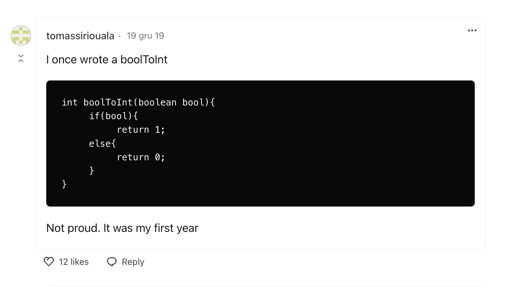
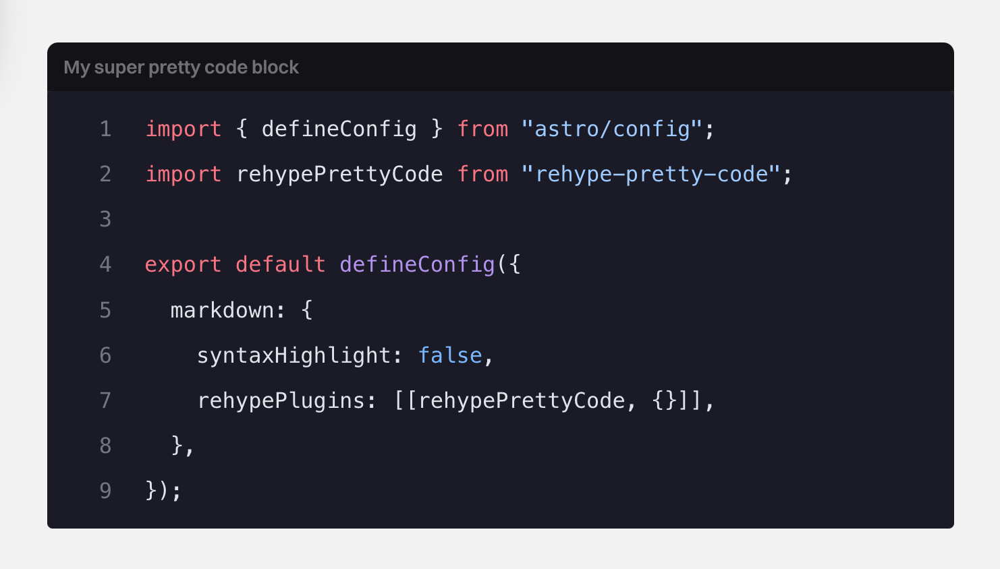

Have you ever looked at a block of code and wanted to gouge your freaking eyes out?

<!--  -->

_This is some random dude's comment on [this post](https://dev.to/weeb/what-s-one-of-the-ugliest-piece-of-code-you-ve-written-so-far-1ej3), hope he doesn't mind (no hard feelings)._

No? Yeah, me neither.

I've been using `rehype-pretty-code`, cause I'm not an idiot.

If you're still presenting your code like an ape with just the basic styling, then I'm sorry – you're an idiot.

BUT, worry no more, cause today I'll show you how with just a couple of lines of code you can stop being one (an idiot, I mean).

## Introducing Rehype

The hype with Rehype (I know, genius) is understandable – with just a few lines of code you can present your code like Picasso (before that Abstraction nonsense).

**Let's make your code look pretty in no time!**

#### 1. Install the plugin

`npm install rehype-pretty-code shiki` (the library is powered by `shiki` syntax highlighter)

If you're interested how it works under the hood you can take a look at the [docs](https://rehype-pretty.pages.dev/).

#### 2. Adjust the `astro.config` file

```js title="astro.config.mjs" {2, 6-7} showLineNumbers
import { defineConfig } from "astro/config";
import rehypePrettyCode from "rehype-pretty-code";

export default defineConfig({
  markdown: {
    syntaxHighlight: false,
    rehypePlugins: [[rehypePrettyCode, {}]],
  },
});
```

At a minimum, you have to add the plugin (duh) and disable Astro's default syntax highlighting.

Now, if you inspect your code blocks, you should see rehype syntax added.

#### 3. Sprinkle some CSS

By design, `rehype` doesn't come with any sort of styling, so you can freely activate your inner Rembrandt (I guess we're also learning about painting today).

You should probably do that without the `rehype` plugin, so let's first add some base styling if you're really starting from scratch (I'll be using some random dark-themed colors, so feel free to adjust it to your liking).

```css
code {
  padding: 0.2em 0.4em;
  color: #f2f2f2;
  font-size: 1rem;
  border-radius: 0.25rem;
  overflow: auto;
  background-color: #1a1b26;
}

pre {
  margin: unset;
  border-radius: 0.5rem;

  code {
    padding: 1rem;
  }
}
```

Now, copy and paste the below `rehype` specific CSS and you should be good to go:

```css title="Code block styling"
figure[data-rehype-pretty-code-figure] {
  pre {
    background-color: #1a1b26;
  }
  code {
    gap: 0.6rem;
    counter-reset: line;
  }

  [data-line] {
    padding: 0 1rem;
  }

  [data-line]::before {
    display: inline-block;
    content: counter(line);
    counter-increment: line;
    width: 1rem;
    margin-right: 1.5rem;
    text-align: right;
    color: rgba(255, 255, 255, 0.4);
  }

  [data-highlighted-line] {
    padding-block: 0.5rem;
    background-color: rgba(255, 255, 255, 0.1);
  }
}
```

```css title="Code block with title styling"
[data-rehype-pretty-code-figure]:has(> [data-rehype-pretty-code-title]) pre {
  border-top-left-radius: 0;
  border-top-right-radius: 0;
}

[data-rehype-pretty-code-title] {
  margin-bottom: 0;
  padding: var(--codeblock-title-padding);
  font-size: 0.875rem;
  font-weight: 600;
  line-height: 1.25rem;
  border-top-left-radius: 0.5rem;
  border-top-right-radius: 0.5rem;
  background-color: #121217;
  color: rgba(255, 255, 255, 0.4);
}
```

Sooooo, if you didn't mess anything up (just kidding, I love you), your code should look something like this:

(Fixing errors with images, sry)

<!--  -->
